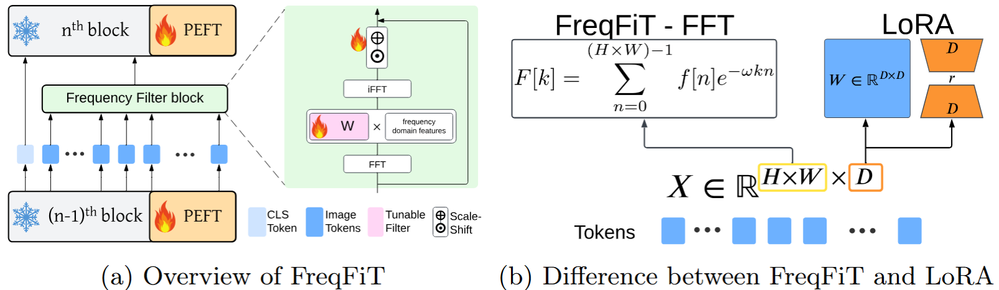

## Frequency Strikes Back: Boosting Parameter-Efficient Foundation Model Adaptation for Medical Imaging

Submitted to MICCAI 2025

<p align="center">

<p align="center"> (a) Overview of FreqFiT. (b) Methodology differences between FreqFiT, utilizing Fast Fourier Transform (FFT), and LoRA. Given input tokens $X \in \mathbb{R}^{H \times W \times D}$, while LoRA operates on the channel dimension $D$ in the spatial domain, FreqFiT, using FFT, processes both the $H \times W$ and $D$ in the frequency domain. This highlights how FreqFiT and PEFT methods complement each other.
</p>

This repository is heavily based on the official PyTorch implementation of [FairMedFM](https://github.com/FairMedFM/FairMedFM)

## Installation

1. Download from github
   ```git
   git clone [https://github.com/FairMedFM/FairMedFM.git](https://github.com/tsly123/FreqFiT_medical.git)
   cd FreqFiT_medical
   ```

2. Creating conda environment

   ```
   conda env create -f environment.yaml
   conda activate freqfitmed
   ```

3. Download Pretrained FMs

    ```
    wget https://object-arbutus.cloud.computecanada.ca:443/rjin/pretrained.zip
    unzip pretrained.zip
    rm -f pretrained.zip
    ```
    or download them separately and place them in the `pretrained` folder

## Running Experiments

### Data Pre-processing
Please follow [DATA section in FairMedFM](https://github.com/FairMedFM/FairMedFM/blob/main/README.md#data).

### Key Configs
Please modify the data config in `configs/datasets/*.json` for csv file for train/val/test set. Also, modify the models config in `configs/models/*.json` for pre-trained weight paths and lora_target layers.

### FreqFit code
- The code for `FreqFit` method is in [wrappers/freqfit.py](https://github.com/tsly123/FreqFiT_medical/blob/main/wrappers/freqfit.py)

- The code for integrating `FreqFit` into PEFT method can be found in its folders, such as [wrappers/adalora](https://github.com/tsly123/FreqFiT_medical/blob/main/wrappers/adalora/adalora_freqfit_medmae.py#L47-L50).

This repo also supports `Scale-Shift` fine-tuning methods as presented in the paper. The preferred method can be set in [--tune_method](https://github.com/tsly123/FreqFiT_medical/blob/main/parse_args.py#L134-L137) or using the cmd in the next section.

### Running command
```
python main.py --usage $peft_method --dataset $dataset \
      --model $pre-trained-weight --blr $base_lr --weight_decay $wd --tune_method $[ori/freqfit/ssf] \
      --batch_size $bs
```
Refer to the [parse_args.py](https://github.com/tsly123/FreqFiT_medical/blob/main/parse_args.py) for details experiment configuration.
